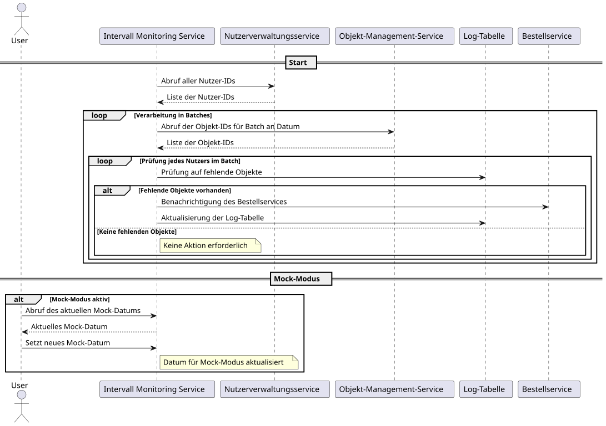

# Intervall Monitoring

Der Intervall Monitoring Service dient der Überwachung des Bestellzyklus.
Der Service wird in einem festen Intervall ausgeführt und prüft, ob eine Bestellung an dem aktuellen Tag fällig ist. Ist dies der Fall, wird der Bestellservice darüber informiert.

- **Autor**: Robert Eggl
- **Technologie**: Quarkus (Java)

---

**Inhaltsverzeichnis**

[[toc]]

## Architekturbeschreibung

Der **Intervall-Monitoring-Service** ist ein Dienst zur Überwachung des Bestellzyklus. Er wird regulär alle 4 Studen ausgeführt, im Mock-Modus alle 15 Sekunden.

### Funktionsweise

Der Service arbeitet in folgenden Schritten:

1. Abruf aller Nutzer-IDs vom **Nutzerverwaltungsservice**.
2. Verarbeitung der Nutzer in 5er-Batches zur Lastverteilung.
3. Für jeden Batch: Abruf der zugehörigen Objekt-IDs vom **Objekt-Management-Service**. Dabei wird direkt der aktuelle Tag übergeben, um nur die Objekte zu erhalten, die an diesem Tag fällig sind.
4. Prüfung jedes Nutzers auf fehlende Objekte durch Abgleich mit der Log-Tabelle.
5. Bei fehlenden Objekten: Benachrichtigung des Bestellservices und Aktualisierung der Log-Tabelle

### Die Rolle der Log-Tabelle

Die Log-Tabelle erfüllt mehrere wichtige Funktionen:

- **Idempotenz**: Auch wenn der Bestellservice doppelte Bestellungen ablehnt, stellt die Log-Tabelle eine zusätzliche Sicherheitsschicht dar
- **Performance**: Schnelle lokale Prüfung ohne Netzwerkanfragen an den Bestellservice
- **Audit-Trail**: Historische Nachverfolgung aller übergebenen Bestellungen
- **Fehleranalyse**: Ermöglicht die Identifikation von Problemen im Bestellprozess

Diese Architektur gewährleistet Zuverlässigkeit und Effizienz bei der Verarbeitung der Bestellungen.

### Sequenzdiagramm

Das folgende Sequenzdiagramm zeigt den vereinfachten Ablauf des Interval Monitoring Services.
::: details Sequenzdiagramm anzeigen

:::

### REST API für Mock-Modus

Der Service bietet Endpunkte für einen Mock-Modus, der für Demonstrations- und Testzwecke verwendet werden kann.
Im Mock-Modus wird ein benutzerdefiniertes Datum für die Intervallprüfung verwendet und die Prüfung erfolgt alle 15 Sekunden statt alle 4 Stunden.

#### Host

Standalone ist der Service unter `http://localhost:8081` erreichbar.

Wird die Anwendung jedoch im Docker Compose gestartet, ist der Service unter `http://localhost:4000/rest/interval` erreichbar. Bei Verwendung von Kubernetes ist der Service extern unter `http://localhost/rest/interval` erreichbar.

#### Endpunkte

| Method | Path          | Description                                           | Content-Type     |
| ------ | ------------- | ----------------------------------------------------- | ---------------- |
| GET    | /mock/enabled | Prüft, ob der Mock-Modus aktiviert ist                | application/json |
| GET    | /mock         | Ruft das aktuell konfigurierte Mock-Datum ab          | application/json |
| POST   | /mock/date    | Setzt ein neues Datum für den Mock-Modus (YYYY-MM-DD) | text/plain       |

Daneben wird von Quarkus automatisch ein Health-Check unter `/q/health` bereitgestellt, welcher von Docker Compose und Kubernetes verwendet wird.

::: warning Hinweis
Der Mock-Modus ist nur für Entwicklungs- und Testzwecke gedacht und sollte in Produktivumgebungen deaktiviert sein. Es findet keine Überprüfung der Authentifizierung statt.
:::

## Dockerfile

Das Dockerfile für den Objekt Management Service ist in `src/main/docker/Dockerfile.jvm` zu finden.

Es verwendet Multi-Stage Builds, um das JAR-File zu erstellen und anschließend in einem schlanken Image zu verpacken.

::: code-group

```dockerfile [Build-Stage]
FROM maven:3.9.9-eclipse-temurin-21 AS builder

WORKDIR /app
COPY pom.xml ./
COPY src ./src

RUN mvn package -batch-mode
```

```dockerfile [Run-Stage]
FROM registry.access.redhat.com/ubi8/openjdk-21:1.20

ENV LANGUAGE='en_US:en'

COPY --from=builder /app/target/quarkus-app/lib/ /deployments/lib/
COPY --from=builder /app/target/quarkus-app/*.jar /deployments/
COPY --from=builder /app/target/quarkus-app/app/ /deployments/app/
COPY --from=builder /app/target/quarkus-app/quarkus/ /deployments/quarkus/

USER 185
ENV JAVA_OPTS_APPEND="-Dquarkus.http.host=0.0.0.0 -Djava.util.logging.manager=org.jboss.logmanager.LogManager"
ENV JAVA_APP_JAR="/deployments/quarkus-run.jar"

ENTRYPOINT [ "/opt/jboss/container/java/run/run-java.sh" ]
```

:::

1. Build-Stage: Erstellt das JAR-File mit Maven

- Verwendet das Template `maven:3.9.9-eclipse-temurin-21` als Basisimage
- Kopiert die `pom.xml` und den `src` Ordner in das Image.
- Führt den Maven Build aus, um das JAR-File zu erstellen.
  - Dieser Schritt installiert, testet und baut das Projekt.
  - `-batch-mode` wird verwendet, um den interaktiven Modus zu deaktivieren.

2. Run-Stage: Verpackt das JAR-File in einem schlanken Image

- Verwendet das Template `registry.access.redhat.com/ubi8/openjdk-21:1.20` als Basisimage
- Kopiert nur das gebaute JAR-File und die benötigten Dateien in das Image.
- Setzt die von Quarkus benötigten Umgebungsvariablen. Nähere Infos lassen scih der Quarkus Dokumentation entnehmen.
- Setzt den User auf `185`, um den Container nicht als Root zu starten.
- Legt den Entrypoint fest, um die Anwendung zu starten.

::: info Wofür ist das andere Dockerfile?
Das `Dockerfile.gh` dient dazu, das Multi-Arch Image effizienter mit GitHub Action zu bauen. Nähere Infos lassen sich [hier](/usage/ci) entnehmen.
:::

## Start ohne Docker

Der Service kann ohne Docker gestartet werden. Dazu muss die Anwendung lokal gebaut und gestartet werden. Allerdings erfordert dieser Dienst die Abhängigkeit zum Nutzer-Management-Service, der URL Validierung und der Datenbank, welche mit dem sql script initialisiert wird. Dazu wird die Verwendung des bereitgestellten Docker Compose Setups empfohlen.
Bei nicht beachten der Abhängigkeiten wird der Service nicht ordnungsgemäß funktionieren.

Gehen Sie wie folgt vor:

1. **Voraussetzungen**: Stellen Sie sicher, dass Maven und eine Java 21 JDK installiert sind.

2. **Projekt klonen**: Klonen Sie das Repository auf Ihren lokalen Rechner.

   ```sh
   git clone https://github.com/roberteggl/THI-CASE-CND-Projekt.git
   cd THI-CASE-CND-Projekt/services/interval-monitor
   ```

3. **Maven Build**: Führen Sie den Maven-Build aus, um die Anwendung zu erstellen. Dieser Schritt führt die Installation, die Tests und das Erstellen des JAR-Files durch.

   ```sh
   mvn package
   ```

4. **Anwendung starten**: Starten Sie die Anwendung mit dem folgenden Befehl:

   ```sh
   java -Dquarkus.http.host=0.0.0.0 -Djava.util.logging.manager=org.jboss.logmanager.LogManager -jar target/quarkus-app/quarkus-run.jar
   ```

   Was dieser Befehl macht:

   - `-Dquarkus.http.host`: Setzt den Host auf `0.0.0.0`, damit die Anwendung von außen erreichbar ist.
   - `-Djava.util.logging.manager`: Setzt den Logging Manager auf den von Quarkus verwendeten, um die Logausgabe zu verbessern.
   - `target/quarkus-app/quarkus-run.jar`: Startet die Anwendung mit dem JAR-File, das durch den Maven Build erstellt wurde.

5. **Zugriff auf die Anwendung**: Die Anwendung ist nun unter `http://localhost:8081` erreichbar.
