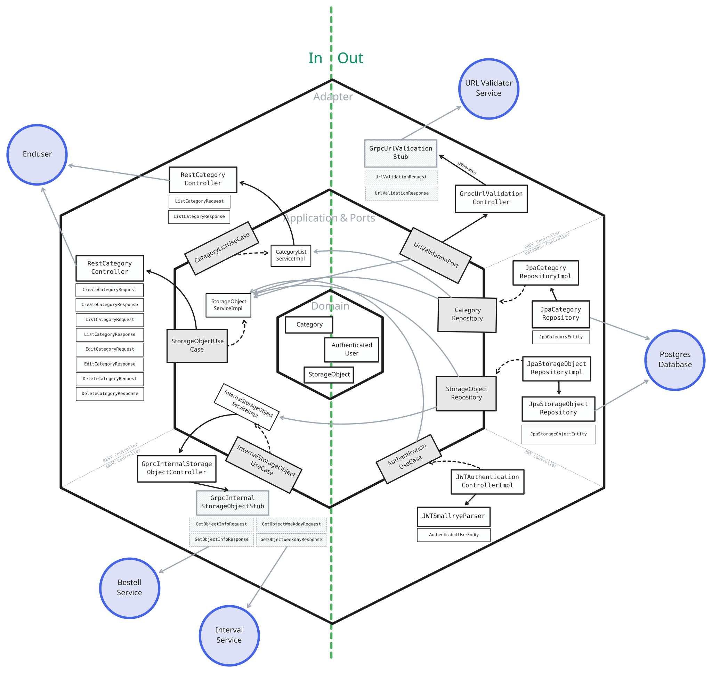
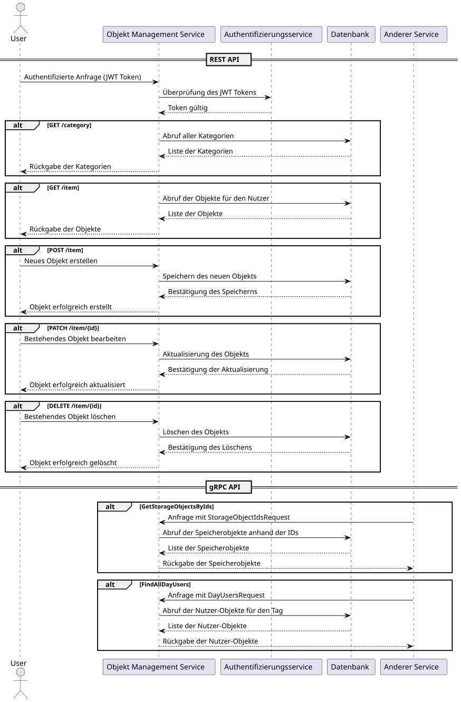

# Objekt Management Service

Der Objekt Management Service ist ein Service zur Verwaltung von Objekten.
Er bietet die Möglichkeit je Nutzer Objekte zu erstellen, bearbeiten und löschen.

- **Autor**: Robert Eggl
- **Architektur**: Hexagonal
- **Technologie**: Quarkus (Java)

## Architektur Beschreibung

Der Objekt Management Service ist ein Service zur Verwaltung von Objekten.

## Architketur Skizze



## Sequenzdiagramm

Das folgende Sequenzdiagramm zeigt den vereinfachten Ablauf der Objektverwaltung ohne die Berücksichtigung der hexagonalen Architektur.



### REST API

Die REST API bietet die Möglichkeit, Objekte zu erstellen, bearbeiten und löschen. Die API ist durch die JWT Authentifizierung geschützt.

#### Host

Standalone ist der Service unter `http://localhost:8080` erreichbar.

Wird die Anwendung jedoch in einem Docker Container gestartet, ist der Service unter `http://localhost:4000/object` erreichbar. Dies ist durch den Reverse Proxy NGINX gewährleistet.

#### Endpunkte

| Method | Path                          | Description                                                          |
| ------ | ----------------------------- | -------------------------------------------------------------------- |
| GET    | [/category](#getcategory)     | Alle verfügbaren Kategorien abrufen                                  |
| GET    | [/item](#getobject)           | Alle Objekte für einen authentifizierten Nutzer abrufen              |
| POST   | [/item](#postobject)          | Ein neues Objekt für einen authentifizierten Nutzer erstellen        |
| PATCH  | [/item/{id}](#putobjectid)    | Ein bestehendes Objekt für einen authentifizierten Nutzer bearbeiten |
| DELETE | [/item/{id}](#deleteobjectid) | Ein bestehendes Objekt für einen authentifizierten Nutzer löschen    |

### gRPC

gRPC dient zur Kommunikation zwischen den Services und ist daher nicht von außen erreichbar.
Der Objekt Management Service bietet als Server die folgenden Services an:

#### ObjectService

| Method                 | Request Type            | Response Type       | Description                                   |
| ---------------------- | ----------------------- | ------------------- | --------------------------------------------- |
| GetStorageObjectsByIds | StorageObjectIdsRequest | StorageObjectsReply | Abrufen von Speicherobjekten anhand ihrer IDs |
| FindAllDayUsers        | DayUsersRequest         | DayUsersReply       | Finden aller Nutzer-Objekte eines Tages       |

## Start ohne Docker

Der Service kann ohne Docker gestartet werden. Dazu muss die Anwendung lokal gebaut und gestartet werden. Allerdings erfordert dieser Dienst die Abhängigkeit zum Nutzer-Management-Service, der URL Validierung und der Datenbank, welche mit dem sql script initialisiert wird. Dazu wird die Verwendung des bereitgestellten Docker Compose Setups empfohlen.
Bei nicht beachten der Abhängigkeiten wird der Service nicht ordnungsgemäß funktionieren.

Gehen Sie wie folgt vor:

1. **Voraussetzungen**: Stellen Sie sicher, dass Maven und eine Java 21 JDK installiert sind.

2. **Projekt klonen**: Klonen Sie das Repository auf Ihren lokalen Rechner.

   ```sh
   git clone https://github.com/roberteggl/THI-CASE-CND-Projekt.git
   cd THI-CASE-CND-Projekt/services/object-management
   ```

3. **Maven Build**: Führen Sie den Maven-Build aus, um die Anwendung zu erstellen. Dieser Schritt führt die Installation, die Tests und das Erstellen des JAR-Files durch.

   ```sh
   mvn package
   ```

4. **Anwendung starten**: Starten Sie die Anwendung mit dem folgenden Befehl:

   ```sh
   java -Dquarkus.http.host=0.0.0.0 -Djava.util.logging.manager=org.jboss.logmanager.LogManager -jar target/quarkus-app/quarkus-run.jar
   ```

   Was dieser Befehl macht:

   - `-Dquarkus.http.host`: Setzt den Host auf `0.0.0.0`, damit die Anwendung von außen erreichbar ist.
   - `-Djava.util.logging.manager`: Setzt den Logging Manager auf den von Quarkus verwendeten, um die Logausgabe zu verbessern.
   - `target/quarkus-app/quarkus-run.jar`: Startet die Anwendung mit dem JAR-File, das durch den Maven Build erstellt wurde.

5. **Zugriff auf die Anwendung**: Die Anwendung ist nun unter `http://localhost:8080` erreichbar.
