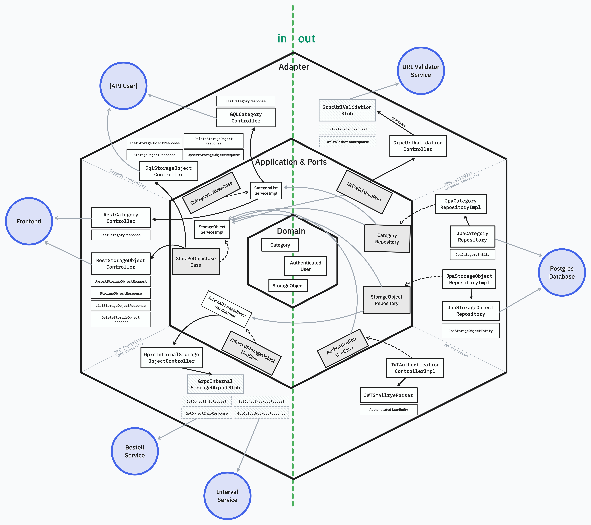
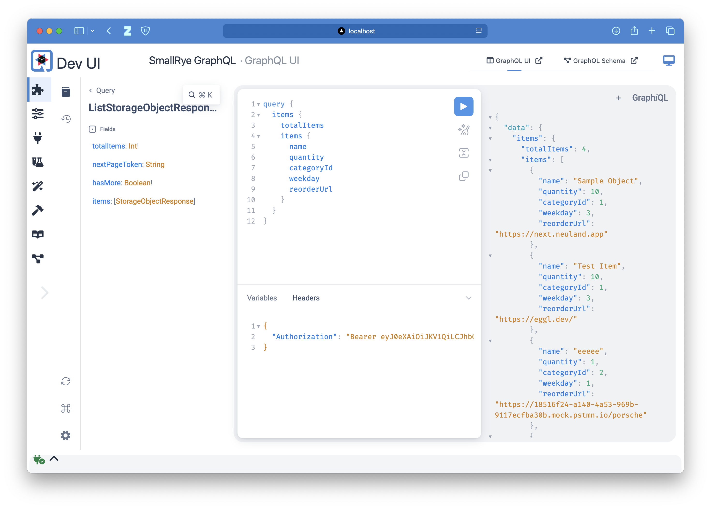
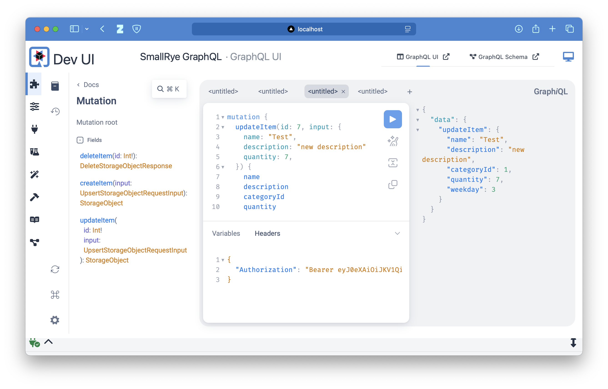
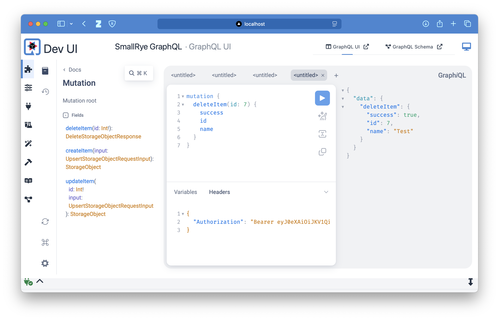

# Objekt Management Service

Der Objekt Management Service ist ein Service zur Verwaltung von Objekten.

- **Autor**: Robert Eggl
- **Architektur**: Hexagonal
- **Technologie**: Quarkus (Java)

## Architektur

### Beschreibung

Dieser Service stellt einen integralen Bestandteil des Gesamtsystems dar. Er ist für die Verwaltung von Objekten zuständig, die von den Nutzern erstellt werden. Die Objekte sind dabei den Nutzern zugeordnet und können in Kategorien eingeteilt werden. Jedes Objekt ist einem Wochentag zugeordnet und kann eine Nachbestell URL enthalten, welche zuvor mithilfe des URL-Validierungsdienstes validiert wurde.

---

Es wird für demonstrierende Zwecke sowohl eine **REST API** als auch eine **GraphQL API angeboten**. Beide Adapter implementieren dabei die gleiche Logik und greifen auf die gleichen Services zu. Die GraphQL API ist dabei als Erweiterung der REST API zu sehen und wird nicht im Frontend verwendet.

Über diese APIs können die Objekte erstellt, bearbeitet und gelöscht werden. Die API ist durch die JWT Authentifizierung im Message Header geschützt.
Über einen weiteren Kategorie Endpunkt können alle verfügbaren Kategorien abgerufen werden. Aufgrund des Modularitätsprinzips ist diese Abfrage unabhänging und nicht in der Objektliste enthalten. Dies könnte in einer späteren Version implementiert werden.

---

Des Weiteren wird ein interner gRPC Service angeboten, der die Kommunikation zwischen den Services ermöglicht. Der Objekt Management Service bietet so für den Intervall- und Besteck-Service die Möglichkeit, Objekte abzurufen. Dabei entfällt der Bedarf einer Authentifizierung, da die Kommunikation intern erfolgt.

### Architketur Skizze



### Sequenzdiagramm

Das folgende Sequenzdiagramm zeigt den vereinfachten Ablauf der Objektverwaltung ohne die Berücksichtigung der hexagonalen Architektur.
::: details Sequenzdiagramm anzeigen

:::

## API Beschreibung

Die REST API und die GraphQL API bieten sämtliche User Operationen an und sind durch die JWT Authentifizierung geschützt. Der JWT Token muss im Header der Anfrage mitgegeben werden.

```sh
{
   "Authorization" : "Bearer <JWT>"
}
```

### Host

- Standalone ist der Service unter `http://localhost:8080` erreichbar.

- Wird die Anwendung jedoch im Docker Compose gestartet, ist der Service unter `http://localhost:4000/rest/object` erreichbar.
- Bei Verwendung von Kubernetes ist der Service extern unter `http://localhost/rest/object` erreichbar.
- Für die Verwendung der GraphQL API ist der Service unter `http://localhost:<port>/graphql` erreichbar.

#### REST API

::: details REST API Endpunkte anzeigen
| Method | Path | Description |
| ------ | ----------------------------- | -------------------------------------------------------------------- |
| GET | [/category](#getcategory) | Alle verfügbaren Kategorien abrufen |
| GET | [/item](#getobject) | Alle Objekte für einen authentifizierten Nutzer abrufen |
| POST | [/item](#postobject) | Ein neues Objekt für einen authentifizierten Nutzer erstellen |
| PATCH | [/item/{id}](#putobjectid) | Ein bestehendes Objekt für einen authentifizierten Nutzer bearbeiten |
| DELETE | [/item/{id}](#deleteobjectid) | Ein bestehendes Objekt für einen authentifizierten Nutzer löschen |

Daneben wird von Quarkus automatisch ein Health-Check unter `/q/health` bereitgestellt, welcher von Docker Compose und Kubernetes verwendet wird.
:::

#### GraphQL API

Die GraphQL API bietet die gleichen Funktionen wie die REST API, allerdings besteht hier die Möglichkeit, die Objekte in einer Abfrage zu kombinieren oder nur selektiv Daten abzurufen.

::: details GraphQL API Beispiele anzeigen

Die nachfolgenden Bilder demonstrieren exemplarisch die Verwendung der GraphQL API mit dem Tool GraphiQL.

#### Objektliste abrufen

Das folgende Beispiel zeigt, wie die Objektliste abgerufen werden kann. Über den JWT Token im Header wird auf die User ID zurückgeschlossen und die Objekte abgerufen.

```graphql
query {
  items {
    id
    name
    quantity
    reorderUrl
    categoryId
  }
}
```



#### Objekt aktualisieren

Über die folgende Mutation wird das Objekt mit der ID 7 aktualisiert. Dabei wird der Name, die Beschreibung, die Anzahl und der Wochentag geändert. In der Antwort werden nur die ausgewählten Felder zurückgegeben anstatt des gesamten Objekts wie es REST API der Fall ist.

```graphql
mutation {
  updateItem(
    id: 7
    input: { name: "Test", description: "new description", quantity: 7 }
  ) {
    name
    description
    categoryId
    quantity
    weekday
  }
}
```



#### Objekt löschen

Das folgende Beispiel zeigt, wie ein Objekt mit der ID 7 gelöscht wird. In der Antwort wird das entsprechende DTO Objekt zurückgegeben.

```graphql
mutation {
  deleteItem(id: 7) {
    success
    id
    name
  }
}
```


:::

### gRPC

gRPC dient zur Kommunikation zwischen den Services und ist daher nicht von außen erreichbar.

::: details gRPC Service anzeigen

| Method                 | Request Type            | Response Type       | Description                                   |
| ---------------------- | ----------------------- | ------------------- | --------------------------------------------- |
| GetStorageObjectsByIds | StorageObjectIdsRequest | StorageObjectsReply | Abrufen von Speicherobjekten anhand ihrer IDs |
| FindAllDayUsers        | DayUsersRequest         | DayUsersReply       | Finden aller Nutzer-Objekte eines Tages       |

:::

## Start ohne Docker

Der Service kann ohne Docker gestartet werden. Dazu muss die Anwendung lokal gebaut und gestartet werden. Allerdings erfordert dieser Dienst die Abhängigkeit zum Nutzer-Management-Service, der URL Validierung und der Datenbank, welche mit dem sql script initialisiert wird. Dazu wird die Verwendung des bereitgestellten Docker Compose Setups empfohlen.
Bei nicht beachten der Abhängigkeiten wird der Service nicht ordnungsgemäß funktionieren.

Gehen Sie wie folgt vor:

1. **Voraussetzungen**: Stellen Sie sicher, dass Maven und eine Java 21 JDK installiert sind.

2. **Projekt klonen**: Klonen Sie das Repository auf Ihren lokalen Rechner.

   ```sh
   git clone https://github.com/roberteggl/THI-CASE-CND-Projekt.git
   cd THI-CASE-CND-Projekt/services/object-management
   ```

3. **Maven Build**: Führen Sie den Maven-Build aus, um die Anwendung zu erstellen. Dieser Schritt führt die Installation, die Tests und das Erstellen des JAR-Files durch.

   ```sh
   mvn package
   ```

4. **Anwendung starten**: Starten Sie die Anwendung mit dem folgenden Befehl:

   ```sh
   java -Dquarkus.http.host=0.0.0.0 -Djava.util.logging.manager=org.jboss.logmanager.LogManager -jar target/quarkus-app/quarkus-run.jar
   ```

   Was dieser Befehl macht:

   - `-Dquarkus.http.host`: Setzt den Host auf `0.0.0.0`, damit die Anwendung von außen erreichbar ist.
   - `-Djava.util.logging.manager`: Setzt den Logging Manager auf den von Quarkus verwendeten, um die Logausgabe zu verbessern.
   - `target/quarkus-app/quarkus-run.jar`: Startet die Anwendung mit dem JAR-File, das durch den Maven Build erstellt wurde.

5. **Zugriff auf die Anwendung**: Die Anwendung ist nun unter `http://localhost:8080` erreichbar.
