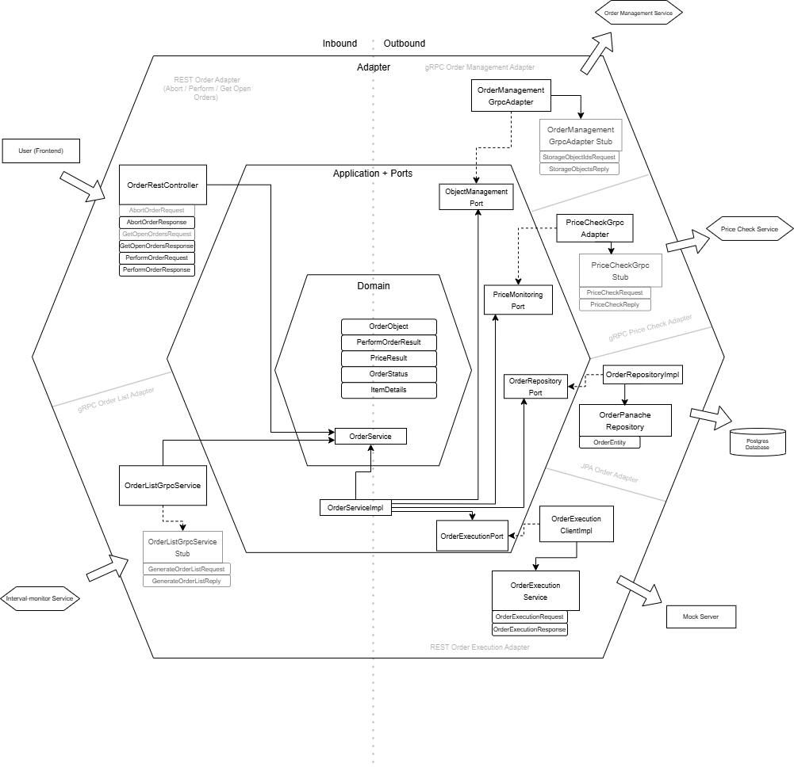

# Bestellungsverwaltung

<!-- Content for Bestellungsverwaltung -->
Bestelllistenservice 
- Autorin: Leonie Rößler
- Architektur: Hexagonal
- Technologie: Quarkus (Java)

Der **Order List Service** verwaltet Bestellungen („Orders“) und ist Bestandteil eines größeren Systems, in dem Artikel (Items) angelegt, deren Preise überwacht und Bestellungen schließlich ausgeführt werden können.
Anlegen von Bestellobjekten in einer Bestellliste, Ausgabe Bestellliste für User, Durchführen von Bestellungen, Löschen ("Stornieren") von Bestellungen

Der folgende Text wurde von ChatGPT generiert.

## Überblick

- **Generierung von Bestelllisten** 
- **Anreichern** der Bestellungen durch externe Services:
    - **Object Management Service** (Artikel-Details, URL, Beschreibung, Menge)
    - **Price Monitoring Service** (Preis und Verfügbarkeit)
- **Ausführen** einer Bestellung über einen externen REST-Endpunkt
- **Abbrechen** offener Bestellungen


Die Anwendung folgt einer **Hexagonalen Architektur** (Ports & Adapters), wodurch die Kernlogik (Domain) sauber von technischen Details (Datenbankzugriff, externe Services) getrennt ist.

## Architektur Skizze



## Architektur (Kurzbeschreibung)


- **Domain Layer**  
  Enthält das Interface `OrderService` und die Domain-Modelle (`OrderObject`, `ItemDetails`, `PriceResult`, `OrderStatus`, `PerformOrderResult`).

- **Application Layer**  
  Implementiert das Domain-Service-Interface (`OrderServiceImpl`). Hier wird die Geschäftslogik orchestriert und über Outbound-Ports auf externe Systeme zugegriffen.

- **Inbound Adapter**
    - `OrderController` (REST-API)
    - `OrderListGrpcService` (gRPC-API)

- **Outbound Adapter**
    - `OrderRepositoryImpl` (Datenbankzugriff)
    - `PriceCheckGrpcAdapter` (Preis-/Verfügbarkeitsabfrage via gRPC)
    - `ObjectManagementGrpcAdapter` (Item-Details via gRPC)
    - `OrderExecutionClientImpl` (REST-Aufruf zum externen Bestellservice)


## Domain Objekte 

- **OrderObject**  
  Repräsentiert eine Bestellung (ID, userId, itemId, cycleDate, Status, Log-Id, etc.)

- **OrderStatus**
    - `OPEN` – Bestellung ist offen, kann noch ausgeführt werden
    - `DONE` – Bestellung wurde erfolgreich ausgeführt
    - `FAILED` – Ausführung fehlgeschlagen
    - `ABORTED` – Bestellung wurde abgebrochen

- **PerformOrderResult**  
  Enthält den Ergebnisstatus und eine Nachricht.

- **PriceResult**  
  Enthält Informationen zu Preis, Verfügbarkeit, Log-Id und einer Status-Message.

- **ItemDetails**  
  Beschreibt die Artikel-Details (Name, URL, Beschreibung, Menge), die von einem externen Service stammen.

---

## REST API

### Übersicht der Endpoints

Base-Path: `/orders`

1. **GET** `/orders`
    - **Beschreibung**: Liefert alle offenen Bestellungen für den aktuell authentifizierten Benutzer (basierend auf `JsonWebToken` / `userId`).
    - **Response**: Array von Order-DTOs (inkl. Artikelname, URL, Preis, Verfügbarkeit etc.).

2. **POST** `/orders/perform`
    - **Beschreibung**: Führt eine offene Bestellung aus.
    - **Request Body** (`PerformOrderRequest`):
      ```json
      {
        "itemId": 1001,
        "quantity": 5
      }
      ```
    - **Response**: HTTP-Status entsprechend Ergebnis (z. B. 200 bei Erfolg) und eine Message.

3. **POST** `/orders/abort/{itemId}`
    - **Beschreibung**: Bricht eine offene Bestellung (OrderStatus=OPEN) ab.
    - **Response**: 200 (OK), falls erfolgreich.

> **Hinweis**: Nutzer muss authentifiziert sein.

---

## gRPC-Schnittstelle

Der gRPC-Service ist unter `OrderListServiceGrpc` implementiert.

### `OrderListGrpcService` (Inbound)

- **Methode**: `generateOrderList(GenerateOrderListRequest) -> GenerateOrderListReply`
    - **Beschreibung**: Erzeugt eine oder mehrere Bestellungen (`OrderObject`) für den angegebenen User, sofern noch keine offene Bestellung für dieselben Artikel existiert.
    - **Request**:
      ```protobuf
      message GenerateOrderListRequest {
        int32 userId = 1;
        repeated int32 objectIds = 2;
        string date = 3;
      }
      ```
    - **Reply**:
      ```protobuf
      message GenerateOrderListReply {
        bool success = 1;
      }
      ```
    - **Beispiel**:
        - Request: `userId=42, objectIds=[1001, 1002], date="2025-01-01"`
        - Reply: `success=true` (oder `false`, falls ein Fehler auftrat)

### Outbound gRPC

- **`PriceCheckGrpcAdapter`**: Nutzt `PriceCheckServiceGrpc.PriceCheckServiceBlockingStub` (Methode `checkPrices`).
- **`ObjectManagementGrpcAdapter`**: Nutzt `ObjectServiceGrpc.ObjectServiceBlockingStub` (Methode `getStorageObjectsByIds`).

Diese Adapter rufen externe Services auf, um Preise bzw. Artikel-Details abzuholen. Sie sind für die Konsument*innen des Order List Service jedoch intransparent, da diese nur das Domain-Interface (`OrderService`) aufrufen.

---

## Hauptfunktionen im Detail

1. **generateOrderList(userId, itemIds, cycleDate)**
    - Legt neue `OrderObject`s an, wenn noch keine offene oder identische Bestellung existiert.
    - Typischer Einsatzzweck: Automatisches Bestellen bestimmter Artikel zu einem bestimmten Tag.

2. **getOpenOrders(userId)**
    - Liefert alle Bestellungen des Users mit Status `OPEN`.
    - Ruft intern `ObjectManagementPort` und `PriceMonitoringPort` auf, um die Bestellungen mit Item- und Preisdaten anzureichern.
    - Setzt Verfügbarkeits-Flags und Meldungen.

3. **performOrder(userId, itemId, quantity, authToken)**
    - Prüft, ob die Bestellung (itemId) für den User überhaupt offen ist.
    - Ruft den **OrderExecutionPort** auf (REST-Client), um den externen Bestellvorgang auszulösen.
    - Aktualisiert den Status: `DONE` bei Erfolg oder `FAILED` bei Fehler.

4. **abortOrder(userId, itemId)**
    - Ändert den Status einer offenen Bestellung auf `ABORTED`.

---

## Beispiel-Sequenz (REST)

1. **Client** ruft `GET /orders` auf und erhält eine Liste aller offenen Bestellungen (mit Preisinfos).
2. **Client** wählt eine Bestellung aus und ruft `POST /orders/perform` auf mit `itemId` und `quantity`.
3. Der Service fragt bei Bedarf Details ab und ruft den OrderExecution-Endpunkt auf.
4. Im Erfolgsfall wird der Status auf `DONE` gesetzt und der Client bekommt eine 200-Antwort.

---

## Konfiguration / Umgebungsvariablen

- `pricecheck.host` / `pricecheck.port`
    - Host und Port für den PriceCheck gRPC-Service
- `objectmanagement.host` / `objectmanagement.port`
    - Host und Port für den ObjectManagement gRPC-Service
- Datenbankzugangskonfiguration (z. B. `quarkus.datasource.jdbc.url`, `quarkus.datasource.username`, …)
- Weitere quarkus-spezifische Settings (Log Level, etc.)

---

## Installation und Start in einer VM

### Voraussetzungen:
- **Betriebssystem:** Linux-basierte Distribution (z. B. Ubuntu, CentOS)
- **Vorinstallierte Software:**
    - Java 21 JDK (z. B. OpenJDK)
    - Maven 3.9.9 oder höher
- **Zugriff auf Internet:** Für Maven-Repositories
### Installation: 

1. Klonen Sie das Repository und wechseln Sie in den Projektordner
   ```bash
   git clone https://github.com/roberteggl/THI-CASE-CND-Projekt.git
   cd THI-CASE-CND-Projekt/services/order-list
   ```
2. Installieren Sie die Abhängigkeiten und bauen Sie das Projekt
   ```bash
   mvn package
   ```
    Nach erfolgreichem Build wird die ausführbare Datei im Verzeichnis target erstellt.

3. Starten Sie den Dienst mit:
   ```bash
   java -Dquarkus.http.host=0.0.0.0 -Djava.util.logging.manager=org.jboss.logmanager.LogManager -jar target/quarkus-app/quarkus-run.jar
   ```
Parameter-Erklärung:
- `-Dquarkus.http.host=0.0.0.0`: Setzt die Bind-Adresse des HTTP-Servers auf `0.0.0.0`. Ermöglicht den Zugriff auf den Dienst von allen Netzwerkadressen, nicht nur localhost.
- `-Djava.util.logging.manager=org.jboss.logmanager.LogManager`: Setzt den Log-Manager auf `org.jboss.logmanager`, der von Quarkus verwendet wird.
- `-jar target/quarkus-app/quarkus-run.jar`: Startet die Anwendung aus der Quarkus-Build-Struktur.

Anschließend ist die Anwendung über http://localhost:8082 erreichbar. 

---

## Zusammenfassung:

Der Order List Service bietet eine zentrale Verwaltung für Bestelllisten. Er integriert mehrere externe Dienste (Preisabfrage, Artikelverwaltung, externe Bestellabwicklung), sodass **Endkunden** oder **interne Services** lediglich gegen eine REST- oder gRPC-Schnittstelle arbeiten müssen und keine Details der externen Systeme kennen. Die Anwendung folgt einer klar getrennten **Ports-&-Adapters-Architektur**, was eine gute Wartbarkeit und Erweiterbarkeit sicherstellt.
