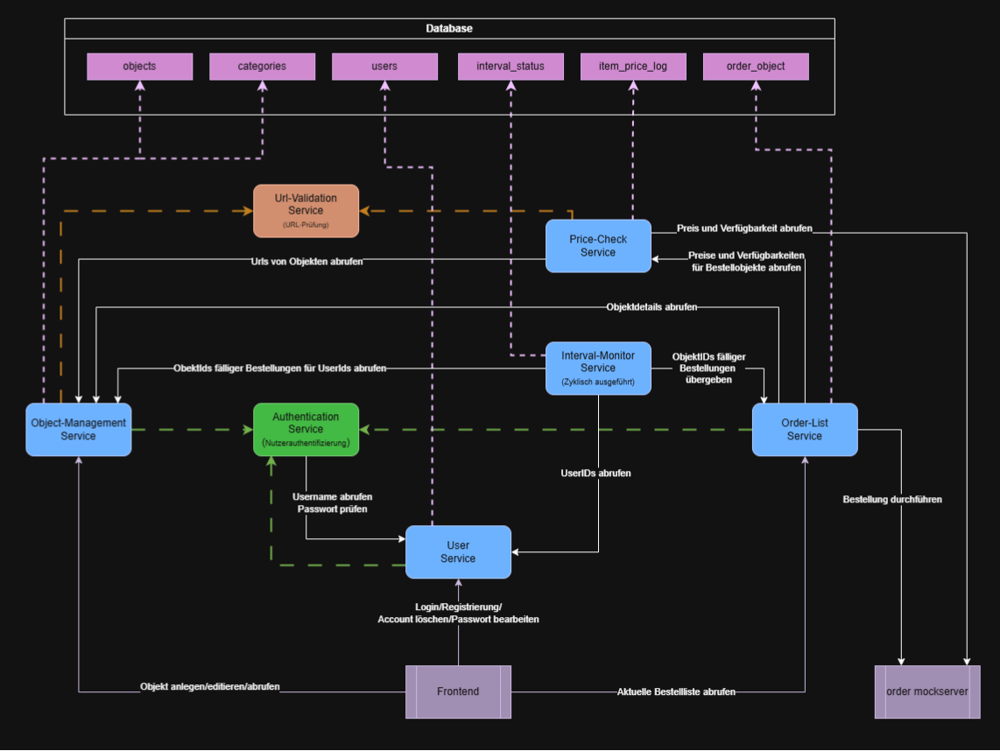

# Projekt Architektur

## Zielsetzung

**SmartOrder** bietet verschiedene Dienste, die die Verwaltung und Bestellung von Haushaltsobjekten effizient unterstützen, ohne einen vollständigen Inventarisierungsdienst bereitzustellen.
Ziel ist es, eine benutzerfreundliche und leicht bedienbare Lösung bereitzustellen, die die automatische Nachbestellung regelmäßig benötigter Produkte vereinfacht.
Dabei soll der Nutzer das gewünschte Produkt und einen Bestellzyklus in unser Dashboard einpflegen können.
Nach Ablauf der Frist enthält eine interaktive Übersicht mit den aktuellen Produktpreisen.
Dies erlaubt eine Anpassung und Korrektur der Bestellobjekte bevor im letzten Schritt die Bestellung getätigt wird.
Daneben wird eine Nutzerverwaltung und Authentifizierung bereitgestellt, um die Sicherheit und den Datenschutz zu gewährleisten.

## Services

Das Projekt besteht aus folgenden Microservices:

| Microservice          | Beschreibung                                                         |
| --------------------- | -------------------------------------------------------------------- |
| **AuthService**       | Zuständig für die Authentifizierung und Autorisierung von Benutzern. |
| **UserService**       | Verwaltung von Benutzerdaten und -profilen.                          |
| **get-item-info**     | Liefert Preis und Verfügbarkeit zu Artikeln.                         |
| **interval-monitor**  | Prüft periodisch auf anfallende Bestellungen.                        |
| **object-management** | Verarbeitet und verwaltet Objekte im System.                         |
| **order-list**        | Verwalten und Abrufen von Bestelllisten.                             |
| **url-validator**     | Prüft und validiert URLs.                                            |

---

## Architektur-Skizze

In dieser Gesamtarchitektur-Skizze sind die Abhängigkeiten zwischen den Services dargestellt.

