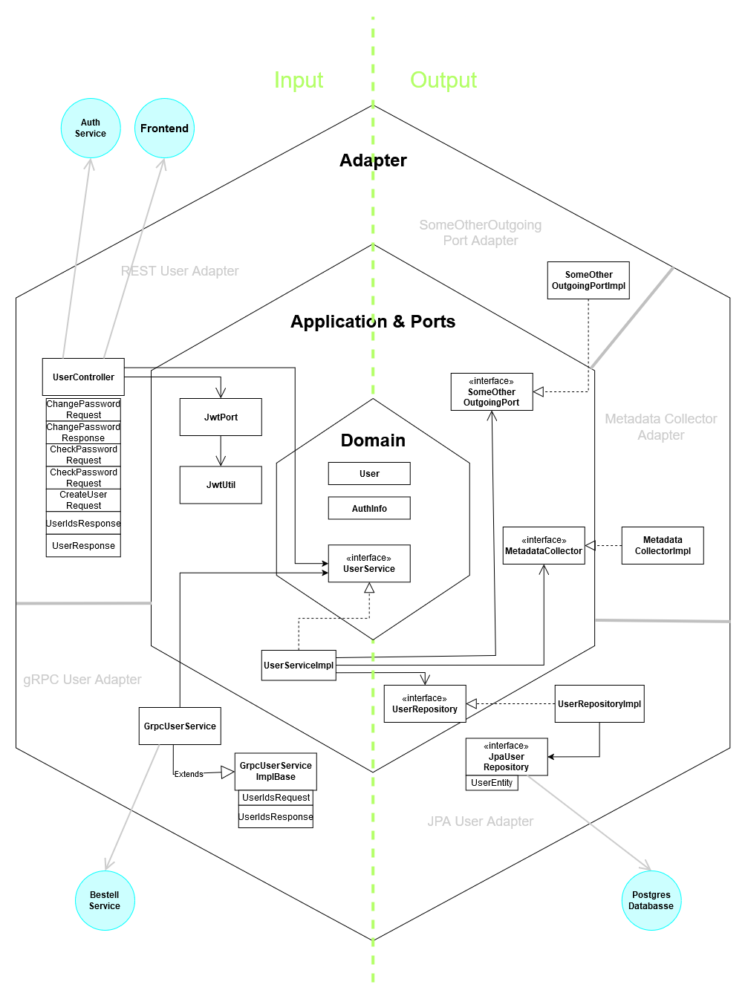

# Nutzerverwaltung

Dieser Nutzerverwalungs Service verwaltet die Nutzeraccounts von Smartorder.
Er bietet die Möglichkeit Nutzeraccounts zu erstellen, verändern und Löschen.

Die Endpunkte dieses Services werden hauptsächlich von anderen Services verwendet.

- **Autor**: Andreas Ziegltrum
- **Architektur**: Hexagonal
- **Technologie**: Spring (Java)

---

**Inhaltsverzeichnis**
[[toc]]

## Architektur 


### Beschreibung

- Dieser Service ist von zentraler Bedeutung. Er verwaltet die Nuzteraccounts und wird vo dem Authentifizierungs Service benötigt. 
- Die Nuzteraccounts werden hier erstellt und verwaltet.


#### Inbound Schnittstellen

Es wird eine **Rest API** und eine **gRPC API** angeboten.


#### Outbound Schnittstellen

- Es besteht eine Datenbankanbindung, um die Entitäten zu speichern und abzurufen.
- Weiterhin wurden zwei Mock Endpunkte hinzugefügt für Demonstrationszwecke


### Architektur Skizze




### Sequenzdiagramm


### Host


- Wird die Anwendung im Docker Compose gestartet, ist der Service unter `http://localhost:4000/rest/user` erreichbar.
- Bei Verwendung von Kubernetes ist der Service extern unter `http://localhost/rest/user` erreichbar.


### REST API

Die REST API bietet die Möglichkeit, Objekte zu erstellen, bearbeiten und löschen. Die API ist durch die JWT Authentifizierung geschützt.


| Method | Path                                       | Description                                                          |JWT|
| ------ | ------------------------------------------ | -------------------------------------------------------------------- | - |
| GET    | [/user/{id}](#getuser)                     | Übergibt alle erlaubten Nutzerdaten                                  | J |
| GET    | [/user/username/{username}](#getuser)      | Alle Objekte für einen authentifizierten Nutzer abrufen              | J |
| POST   | [/user](#postnewuser)                      | Erstellen eines neuen Nutzeraccounts                                 | J |
| POST   | [/user/{id}/changepw}](#putpasswordch)     | Ändern des Passworts eienes Nutzeraccounts                           | J |
| DELETE | [/user/{id}](#deleteuser)                  | Löschen eines Nutzeraccounts                                         | J |
| Post   | [/user/checkpassword](#postcheckpassword)  | Endpunkt für Authservice für die Überprufung von Passworten          | J |
| GET    | [/user/userids](#getuserids)               | Übergibt Liste aller vorhanden userids                               | N |
| GET    | [/actuator/health](#gethealth)             | Health Endpunkt                                                      | N |


### gRPC

gRPC dient zur Kommunikation zwischen den Services und ist daher nicht von außen erreichbar, weshalb die Notwendigkeit einer Authentifizierung entfällt.

::: details gRPC Service anzeigen

| Method                 | Request Type            | Response Type       | Description                                   |
| ---------------------- | ----------------------- | ------------------- | --------------------------------------------- |
| getUserIds             | UserIdsRequest          | UserIdsResponse     | Finden aller UserIDs                          |

:::

## Dockerfile

Das Dockerfile für den Nutzerverwaltung Service ist in `.\Dockerfile`.

Es verwendet Multi-Stage Builds, um das JAR-File zu erstellen und anschließend in einem schlanken Image zu verpacken.


::: code-group

```dockerfile [Build-Stage]
FROM gradle:8.11.1-jdk23 AS builder

WORKDIR /tmp
COPY build.gradle /tmp
COPY settings.gradle /tmp
RUN gradle dependencies --no-daemon --parallel
COPY src /tmp/src/
RUN gradle build --no-daemon --parallel
```

```dockerfile [Run-Stage]
FROM eclipse-temurin:23-jre-alpine

RUN apk --no-cache add bash curl
WORKDIR /app
COPY --from=builder /tmp/build/libs/*.jar /app/app.jar
EXPOSE 8080
EXPOSE 9091
ENTRYPOINT ["java", "-jar", "app.jar"]
```

:::

1. Build-Stage: Erstellt das JAR-File mit Gradle

- Verwendet das Template `gradle:8.11.1-jdk23` als Basisimage.
- Legt das Arbeitsverzeichnis auf `/tmp`.
- Kopiert die `build.gradle` und `settings.gradle` Dateien in das Image.
- Führt den Befehl `gradle dependencies` aus:
  - Installiert und cached die Projektabhängigkeiten.
  - Nutzt die Optionen `--no-daemon` und `--parallel`, um den Build zu beschleunigen.
- Kopiert den `src` Ordner in das Image.
- Führt den Gradle-Build-Prozess aus:
  - Erstellt das JAR-File.
  - Nutzt ebenfalls die Optionen `--no-daemon` und `--parallel`, um Ressourcen optimal zu nutzen.

2. Run-Stage: Verpackt das JAR-File in einem schlanken Image

- Verwendet das Template `eclipse-temurin:23-jre-alpine` als Basisimage.
- Installiert zusätzliche Tools wie `bash` und `curl` über `apk --no-cache add`.
- Setzt das Arbeitsverzeichnis auf `/app`.
- Kopiert das gebaute JAR-File aus dem `builder`-Stage nach `/app` und benennt es als `app.jar`.
- Öffnet die Ports `8080` und `9091`, um die Anwendung verfügbar zu machen.
- Legt den Entrypoint fest, um die Anwendung mit dem Befehl `java -jar app.jar` zu starten.

::: info Wofür ist das andere Dockerfile?
Das `Dockerfile.gh` dient dazu, das Multi-Arch Image effizienter mit GitHub Action zu bauen. Nähere Infos lassen sich [hier](/usage/ci) entnehmen.
:::
